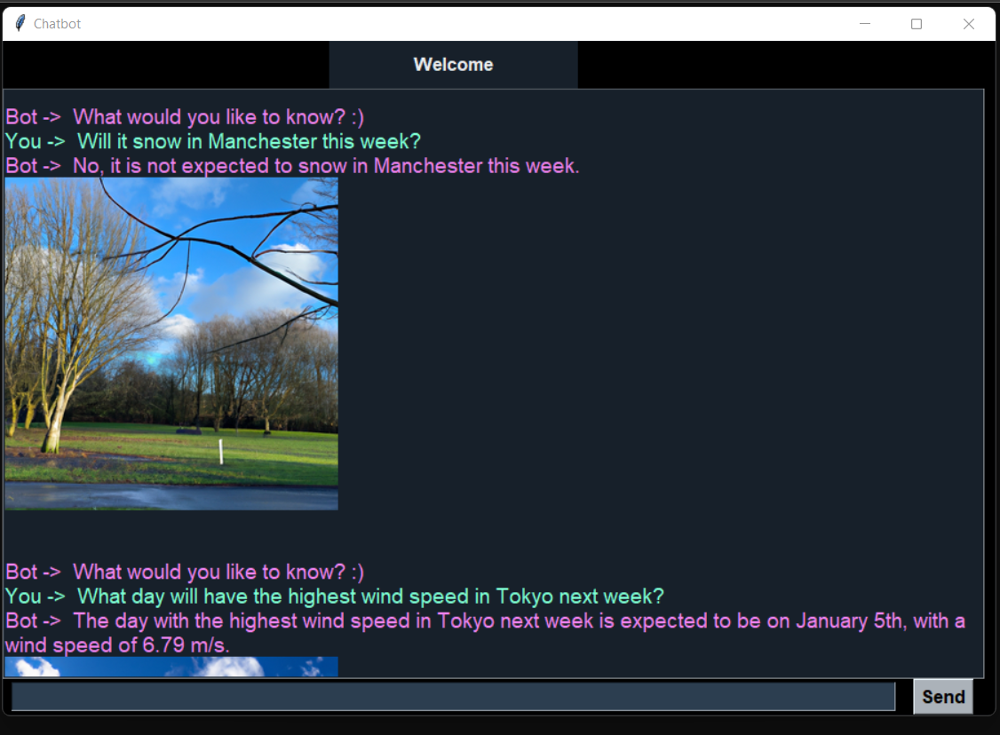

# Weather Chat App

A messaging GUI and AI chatbot, which allows the user to ask questions about the weather in a specific city over the next 5 days.

### What is project uses:
- Tkinter - Library to create the GUI
- OpenWeatherAPI - To get data about the next 5 day's weather for a specific city
- ChatGPT AI - To respond to the user's requests, given all the weather data for the city.
- DELL-E - To create an image based on the response that ChatGPT AI returns

### How to set-up:
1) Install dependencies in 'requirements.txt' file
2) Create an account with openai and add the given API into the 'config.toml' file
3) Create an account with openWeatherApi and add the given API into the 'config.toml' file

### How to use:
1) Run the 'weatherchatGUI.py' app
2) In the tkinter GUI, input questions for the chatbot

### Example Questions:
- `"What is the weather in New york city today?"`
    

  
- `"What is the weather in Chicago tomorrow?"`
    

- `"When will it rain in Paris this week?"`
    

- `"Will it snow in Manchester this week?"`
    

- `"Will it snow in Manchester this week?"`
    

